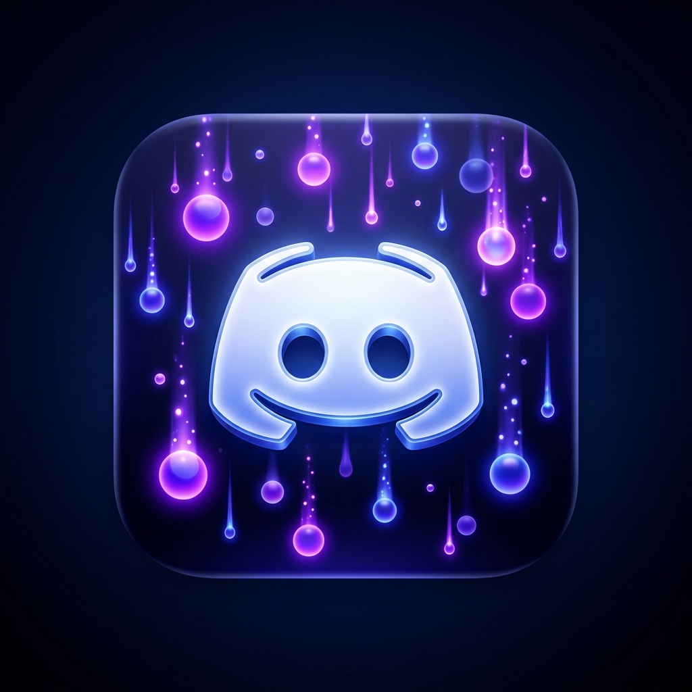

# Discord Orbs Earner (v2.0)

  

An experimental tool for parsing the Discord games database and running mock game instances ("Spoofing") to earn Discord Quest rewards without installing the actual games.

## Features
- **Cross-Platform Native Spoofing**: Fully bypasses Discord's PE metadata checks by utilizing a native, zero-metadata C# runner on Windows, and native core tools on Linux. No bloated Python processes to get detected!
- **Side-by-Side UI**: Track your active spoofed games and monitor real-time system logs in a unified, split-screen modern Flet GUI.
- **Language Support**: Full English and Russian localization.
- **Full Database Support**: Search and spoof any of Discord's ~10,400+ registered PC games.

## ⚠️ Disclaimer
**WARNING! READ BEFORE USE**

This program is an experimental tool provided 'as is' exclusively for educational and research purposes.
It is **strictly prohibited** to use it for profit, automated farming, or circumventing Discord's Terms of Service.
The author is not responsible for any potential account bans or penalties. You use this software entirely at your own risk!

## Requirements
- Windows or Linux OS.
- Python 3.9+ (If running from source).

## Installation & Usage

Download the latest standalone executable for Windows/Linux from the [Releases](../../releases/latest) page, or run from source:

1. Clone the repository.
2. Run `run.bat` (on Windows) which will automatically create a virtual environment and install all dependencies.
   - Or install dependencies manually: `pip install -r requirements.txt`
3. Launch the GUI: `python src/app.py`
4. Click "Play" on any game to start the spoofing runner.

---

# Discord Orbs Earner (v2.0 - RU)

  

Экспериментальная утилита для парсинга базы игр Discord и запуска фиктивных процессов ("Спуфинг") для выполнения квестов Discord без необходимости устанавливать сами игры.

## Особенности
- **Кроссплатформенный нативный спуфинг**: Полностью обходит проверки метаданных PE-заголовков Discord благодаря использованию нативного "чистого" C# раннера на Windows и системных утилит на Linux. Никаких тяжелых Python-процессов, которые легко палятся!
- **Параллельный интерфейс (UI)**: Отслеживайте запущенные игры и системный лог событий в едином, удобном side-by-side интерфейсе на базе Flet.
- **Поддержка языков**: Полная локализация на русский и английский.
- **Полная база игр**: Поддержка всей базы данных ПК-игр Discord (более 10 400+ игр).

## ⚠️ Важное уведомление (Disclaimer)
**ВНИМАНИЕ! ПРОЧТИТЕ ПЕРЕД ИСПОЛЬЗОВАНИЕМ**

Данная программа является экспериментальным инструментом и предоставляется «как есть» исключительно в образовательных и исследовательских целях.
**Строго запрещено** использовать её в коммерческих целях, для автоматизированного фарминга или обхода Правил использования (Terms of Service) Discord.
Автор не несет ответственности за возможные блокировки аккаунтов или иные санкции. Вы используете данный софт полностью на свой страх и риск!

## Установка и использование

Скачайте последнюю версию для Windows или Linux со страницы [Releases](../../releases/latest), либо запустите из исходного кода:

1. Склонируйте репозиторий.
2. Запустите `run.bat` (на Windows), который автоматически создаст виртуальное окружение и установит нужные библиотеки.
   - Или установите зависимости вручную: `pip install -r requirements.txt`
3. Запустите интерфейс: `python src/app.py`
4. Нажмите "Play" на любой игре, чтобы начать спуфинг.
